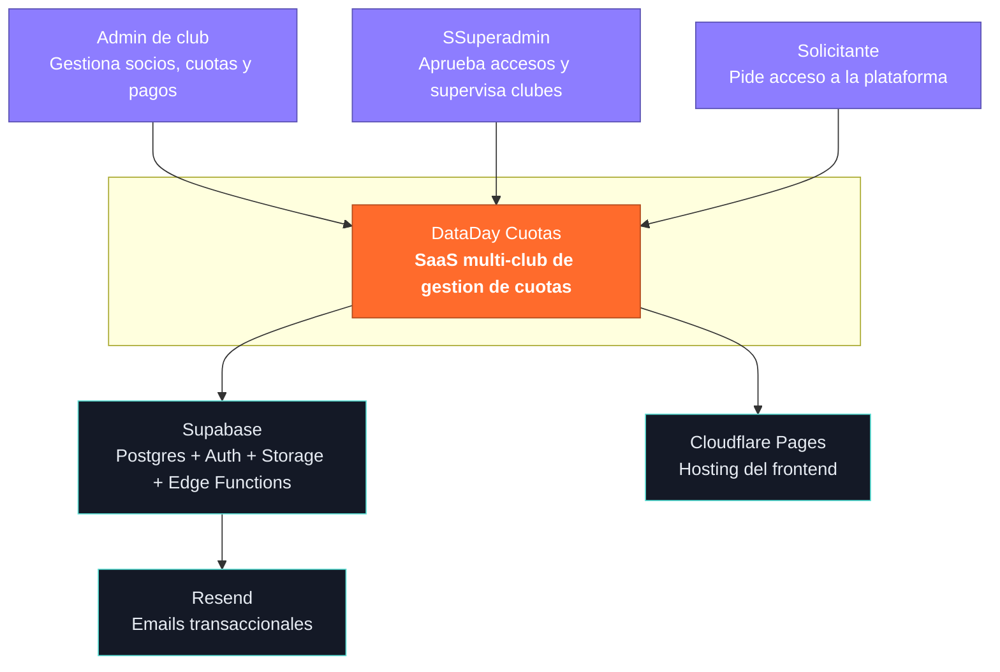
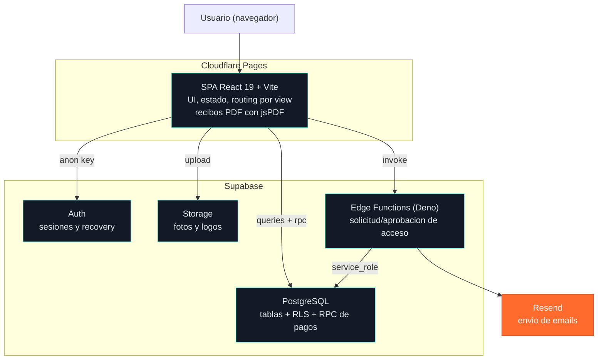
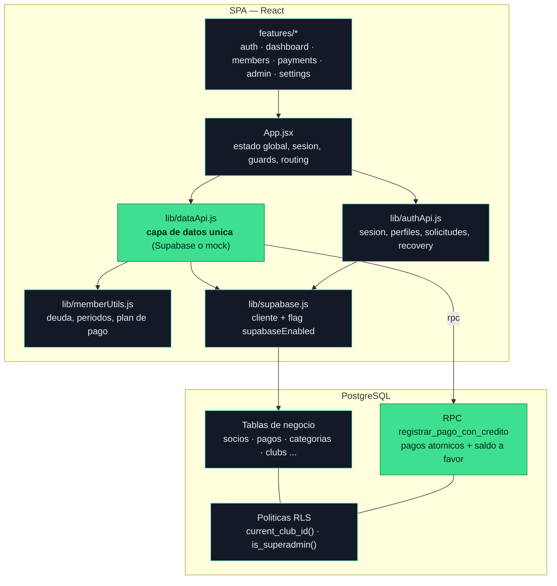

# Diagramas C4 — DataDay Cuotas

Modelo C4 en tres niveles (Contexto, Contenedores, Componentes), en Mermaid, reflejando la
arquitectura real. GitHub renderiza estos diagramas automáticamente.

---

## Nivel 1 — Contexto

Quién usa el sistema y con qué sistemas externos habla.

---

## Nivel 2 — Contenedores

Las piezas desplegables y cómo se comunican.

---

## Nivel 3 — Componentes (dentro de la SPA y la base)

Componentes internos clave y la regla de oro: la UI nunca toca Supabase directo.

---

## Notas de arquitectura

- **La UI nunca llama a Supabase directo**: todo pasa por `dataApi.js` / `authApi.js`. Eso
  permite el modo mock y aísla a los componentes de la fuente de datos.
- **El aislamiento entre clubes lo garantiza la base** (RLS), no el frontend.
- **La lógica de dinero está del lado del servidor** en un RPC atómico.
- Ver decisiones detalladas en `docs/architecture/adr/`.
